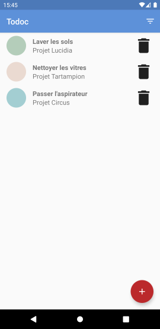

# Todoc

Application du 5ème projet du parcours OpenClassrooms « Développeur d’application - Android » 

## Description

Application de gestion de tâches. Les tâches sont regroupées par projet et peuvent être triées par ordre alphabétique ou par ancienneté.

## Compétences mises en œuvre

- Développée en **Java**
- Architecture **MVVM**
- Données stockées dans un base SQLite avec **ROOM**

## Aperçu

    